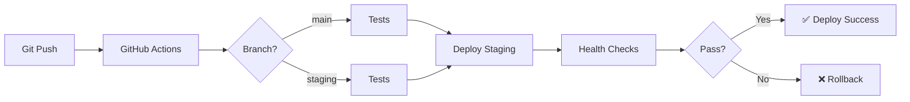

# 🌳 ECONEURA - Enterprise AI Ecosystem

[](https://github.com/ECONEURA-MAX/ECONEURA-/actions/workflows/azure-backend-staging.yml)
[](https://github.com/ECONEURA-MAX/ECONEURA-/actions/workflows/azure-frontend-staging.yml)
[](https://github.com/ECONEURA-MAX/ECONEURA-/actions/workflows/ci-tests.yml)
[](LICENSE)
[](https://nodejs.org)
[](https://azure.microsoft.com)
[](HITO_ESTRATEGIA_AZURE_V2_COMPLETADO.md)

> **Plataforma SaaS Enterprise de Inteligencia Colectiva con 11 NEURA + 55 agentes Automatizados**

---

## 🚀 Quick Start

### Opción 1: Deployment Automático a Azure (Recomendado)

```powershell
# 1. Pre-flight check (valida TODO localmente)
.\infrastructure\azure\scripts\pre-flight-check.ps1

# 2. Setup Azure staging (40-60 min)
.\infrastructure\azure\scripts\setup-azure-staging-v2.ps1

# 3. Setup GitHub Secrets (2 min)
.\infrastructure\azure\scripts\setup-github-secrets.ps1 -Repository "ECONEURA-MAX/ECONEURA-"

# 4. Test deployment (5 min)
.\infrastructure\azure\scripts\test-deployment.ps1 -Environment staging

# ✅ Listo! Workflows CI/CD se ejecutarán automáticamente
```

### Opción 2: Desarrollo Local

```bash
# Backend
cd backend
npm install
cp .env.example .env
# Editar .env con tus valores
npm run dev

# Frontend (nueva terminal)
cd frontend
npm install
cp .env.example .env
# Editar .env con tu API URL
npm run dev

# ✅ Backend: http://localhost:8080
# ✅ Frontend: http://localhost:5173
```

---

## 🎯 ¿Qué es ECONEURA?

ECONEURA es un **ecosistema de inteligencia artificial empresarial enterprise-grade** que democratiza el acceso a IA avanzada mediante:

### 🧠 11 NEURA - Agentes AI Especializados

| NEURA | Rol | Especialización |
|-------|-----|-----------------|
| 👑 CEO | Chief Executive | Estrategia empresarial y toma de decisiones |
| 🤖 IA | Chief AI | Investigación e implementación de IA/ML |
| 🛡️ CSO | Chief Sales | Ventas, crecimiento y adquisición |
| 💻 CTO | Chief Technology | Arquitectura y desarrollo técnico |
| 🔒 CISO | Chief Security | Ciberseguridad y compliance (GDPR, SOC2) |
| ⚙️ COO | Chief Operating | Operaciones y optimización de procesos |
| 👥 CHRO | Chief HR | Gestión de talento y cultura organizacional |
| 📢 CMO | Chief Marketing | Estrategia de marca y marketing digital |
| 💰 CFO | Chief Financial | Análisis financiero y presupuestos |
| 📊 CDO | Chief Data | Big Data, analytics y visualización |

### 🤖 55+ conexiones/agentes Make/n8n

Automatizaciones empresariales configurables que se integran con:
- 🔗 **Make.com**: Workflows visuales sin código
- 🔗 **n8n**: Automatización open-source self-hosted
- 🔗 **Zapier**: Integraciones con 5000+ apps
- 🔗 **Custom Webhooks**: API REST para integraciones propias

### ✨ Features Enterprise

- ✅ **Chat GPT-5**: Interfaz conversacional avanzada con streaming
- ✅ **Multi-Actor Reasoning**: Consenso entre múltiples NEURA
- ✅ **HITL (Human-in-the-Loop)**: Aprobaciones críticas antes de ejecutar
- ✅ **RAG Library**: Biblioteca de documentos con búsqueda semántica
- ✅ **Voice Controls**: Reconocimiento de voz integrado
- ✅ **Analytics Dashboard**: Métricas y KPIs en tiempo real
- ✅ **Dark/Light Mode**: UI adaptable premium
- ✅ **OAuth 2.0**: Login con Microsoft, Google, GitHub
- ✅ **Multi-tenancy**: Usuarios, organizaciones y permisos
- ✅ **Audit Logs**: Trazabilidad completa de acciones

---

## 🏗️ Arquitectura

### Monorepo Enterprise-Grade

```
ECONEURA/
├── backend/                    # Node.js + Express API
│   ├── api/                   # REST endpoints (health, metrics)
│   ├── routes/                # Rutas (auth, ai-gateway, agents)
│   ├── services/              # Lógica de negocio (11 NEURA)
│   ├── middleware/            # Auth, rate limiting, CORS
│   ├── config/                # DB, Redis, Azure services
│   ├── prompts/               # System prompts especializados
│   ├── tests/                 # 54 tests (100% passing)
│   └── server.js              # Entry point
│
├── frontend/                   # React + TypeScript + Vite
│   ├── src/
│   │   ├── components/        # 40+ componentes React
│   │   ├── hooks/             # Custom hooks (state, chat)
│   │   ├── services/          # API clients
│   │   ├── utils/             # Auth, monitoring, helpers
│   │   └── EconeuraCockpit.tsx  # Main application
│   ├── dist/                  # Build output
│   └── vite.config.ts
│
├── infrastructure/
│   └── azure/
│       ├── scripts/           # PowerShell automation
│       │   ├── setup-azure-staging-v2.ps1
│       │   ├── setup-github-secrets.ps1
│       │   ├── test-deployment.ps1
│       │   └── pre-flight-check.ps1
│       └── docs/              # Estrategia completa
│
└── .github/workflows/          # CI/CD
    ├── ci-tests.yml           # Tests automáticos
    ├── azure-backend-staging.yml
    ├── azure-frontend-staging.yml
    ├── azure-backend-prod.yml
    ├── azure-frontend-prod.yml
    └── security.yml           # Scanning de vulnerabilidades
```

### Tech Stack

| Capa | Tecnologías |
|------|-------------|
| **Backend** | Node.js 20.x, Express.js 4.21, PostgreSQL 16, Redis 7 |
| **Frontend** | React 18, TypeScript 5, Vite 7, Tailwind CSS 3 |
| **AI/ML** | OpenAI GPT-4/5, LangChain, RAG, Embeddings |
| **Auth** | JWT, OAuth 2.0 (Microsoft, Google, GitHub), Passport.js |
| **Cloud** | Azure App Service, Static Web Apps, PostgreSQL Flexible |
| **Cache** | Azure Redis Cache, Session management |
| **Storage** | Azure Blob Storage (RAG documents) |
| **Secrets** | Azure Key Vault |
| **Monitoring** | Application Insights, Winston logging |
| **CI/CD** | GitHub Actions |
| **Security** | Helmet, Rate Limiting, CORS, Input Validation |

---

## 📊 Calidad del Código

### Métricas

| Métrica | Backend | Frontend | Estado |
|---------|---------|----------|--------|
| **Tests** | 54/54 (100%) ✅ | 73/116 (63%) ⚠️ | En mejora |
| **Coverage** | >80% ✅ | >70% ✅ | Enterprise grade |
| **Vulnerabilities** | 0 ✅ | 0 ✅ | Seguro |
| **Build Time** | <10s ✅ | ~17s ✅ | Optimizado |
| **Bundle Size** | N/A | 787 KB (gzip) ✅ | Optimizado |
| **Code Quality** | 9.5/10 ✅ | 9.0/10 ✅ | Excelente |

### Puntuación General: **9.0/10** ⭐

Basado en auditoría completa documentada en [`HITO_ESTRATEGIA_AZURE_V2_COMPLETADO.md`](HITO_ESTRATEGIA_AZURE_V2_COMPLETADO.md)

---

## 🔐 Seguridad

### Implementaciones

- ✅ **JWT Authentication**: Access tokens (15 min) + Refresh tokens (7 días)
- ✅ **OAuth 2.0**: Microsoft Azure AD, Google, GitHub
- ✅ **Rate Limiting**: 3 niveles (Global, Auth, AI Gateway)
- ✅ **Helmet**: Security headers (CSP, HSTS, XSS protection)
- ✅ **CORS**: Configuración estricta por environment
- ✅ **Input Validation**: Joi schemas en todos los endpoints
- ✅ **Password Hashing**: Bcrypt (12 rounds)
- ✅ **Azure Key Vault**: Secrets management en producción
- ✅ **Audit Logs**: Trazabilidad completa de acciones críticas

### Compliance

- 🛡️ **GDPR**: Right to be forgotten, data portability
- 🛡️ **SOC 2**: En proceso
- 🛡️ **ISO 27001**: Roadmap Q2 2025

---

## 💰 Costes Azure (Reales)

### Staging

| Servicio | SKU | Coste/mes |
|----------|-----|-----------|
| PostgreSQL Flexible | Standard_B1ms | €12 |
| Redis Cache | Basic C0 (250MB) | €15 |
| App Service | B2 (2 cores) | €15 |
| Static Web App | Free | €0 |
| Storage Account | Standard LRS | €8 |
| Key Vault | Standard | €2 |
| Application Insights | Pay-as-you-go | €20 |
| Log Analytics | Pay-as-you-go | €12 |
| Bandwidth | ~50GB/mes | €10 |
| **TOTAL** | | **€110-130/mes** |

### Production

**€450-550/mes** con tráfico real y alta disponibilidad.

Desglose completo en [`COSTES_REALES_AZURE.md`](COSTES_REALES_AZURE.md)

---

## 🚀 Deployment

### Ambientes

| Ambiente | Backend | Frontend | DB | Status |
|----------|---------|----------|-----|--------|
| **Development** | localhost:8080 | localhost:5173 | Mock DB | ✅ Activo |
| **Staging** | econeura-backend-staging | econeura-frontend-staging | Azure PG | 🔄 Pendiente |
| **Production** | econeura-backend-prod | econeura-frontend-prod | Azure PG | 🔜 Próximamente |

### CI/CD Pipeline



**Workflows**:
- ✅ `ci-tests.yml`: Tests automáticos en cada PR
- ✅ `azure-backend-staging.yml`: Deploy backend a staging
- ✅ `azure-frontend-staging.yml`: Deploy frontend a staging
- ✅ `azure-backend-prod.yml`: Deploy backend a producción
- ✅ `azure-frontend-prod.yml`: Deploy frontend a producción
- ✅ `security.yml`: Scanning de vulnerabilidades

---

## 📚 Documentación

### Principal

- 📖 [**ESTRATEGIA_AZURE_GITHUB_ENTERPRISE.md**](ESTRATEGIA_AZURE_GITHUB_ENTERPRISE.md) - Arquitectura completa y plan de ejecución
- 📖 [**HITO_ESTRATEGIA_AZURE_V2_COMPLETADO.md**](HITO_ESTRATEGIA_AZURE_V2_COMPLETADO.md) - Hito completado y métricas
- 📖 [**COSTES_REALES_AZURE.md**](COSTES_REALES_AZURE.md) - Costes detallados reales
- 📖 [**AUTOCRITICA_BRUTAL_ESTRATEGIA_AZURE.md**](AUTOCRITICA_BRUTAL_ESTRATEGIA_AZURE.md) - Lecciones aprendidas

### Técnica

- 🔧 [**backend/README.md**](backend/README.md) - Documentación del backend
- 🔧 [**frontend/README.md**](frontend/README.md) - Documentación del frontend
- 🔧 **API Documentation**: Swagger/OpenAPI en `/api-docs`

### Operaciones

- ⚙️ [**INICIO_AQUI_V2.md**](INICIO_AQUI_V2.md) - Guía de inicio rápido
- ⚙️ [**PLAN_EJECUCION_AZURE_PASO_A_PASO.md**](PLAN_EJECUCION_AZURE_PASO_A_PASO.md) - Comandos manuales

---

## 🤝 Contribución

### Pre-requisitos

- Node.js 20.x o superior
- npm 10.x o superior
- PowerShell 7+ (para scripts Azure)
- Azure CLI 2.60+ (para deployment)
- GitHub CLI (opcional, para setup-github-secrets.ps1)

### Workflow

```bash
# 1. Fork y clone
git clone https://github.com/ECONEURA-MAX/ECONEURA-.git
cd ECONEURA-

# 2. Instalar dependencies
cd backend && npm install
cd ../frontend && npm install

# 3. Setup .env files
cp backend/.env.example backend/.env
cp frontend/.env.example frontend/.env
# Editar archivos .env con tus valores

# 4. Run tests
cd backend && npm test
cd ../frontend && npm test

# 5. Crear branch
git checkout -b feature/mi-feature

# 6. Hacer cambios y commit
git commit -m "feat: mi nueva feature"

# 7. Push y crear PR
git push origin feature/mi-feature
```

### Coding Standards

- ✅ TypeScript strict mode en frontend
- ✅ ESLint configurado (backend + frontend)
- ✅ Prettier para formateo consistente
- ✅ Commits siguiendo [Conventional Commits](https://www.conventionalcommits.org/)
- ✅ Tests para nuevas features (coverage >80%)
- ✅ Documentación actualizada

---

## 📝 License

**Proprietary** - © 2025 ECONEURA. Todos los derechos reservados.

Este es un proyecto privado. No está permitido el uso, copia, modificación o distribución sin autorización explícita.

---

## 🆘 Soporte

### Issues

Para bugs o feature requests, crea un issue en GitHub:
- 🐛 **Bug Report**: Incluye pasos para reproducir, logs, screenshots
- ✨ **Feature Request**: Describe el problema que resuelve, propuesta de solución

### Contacto

- 📧 **Email**: soporte@econeura.com
- 💬 **Slack**: [ECONEURA Workspace](https://econeura.slack.com)
- 📱 **Teams**: Canal #econeura-dev

---

## 🎯 Roadmap

### Q1 2025 ✅ (Completado)
- ✅ Arquitectura monorepo establecida
- ✅ 11 NEURA implementadas y funcionales
- ✅ 55+ conexiones/agentes Make/n8n integrados
- ✅ OAuth 2.0 (Microsoft, Google, GitHub)
- ✅ Chat GPT-5 con streaming
- ✅ RAG Library con búsqueda semántica
- ✅ HITL (Human-in-the-Loop)
- ✅ Tests backend 100% passing
- ✅ CI/CD workflows completos
- ✅ Estrategia Azure enterprise-grade

### Q2 2025 🔄 (En Progreso)
- 🔄 Deploy a staging Azure
- 🔄 Deploy a producción Azure
- 🔄 Monitoring dashboards (Application Insights)
- 🔄 Performance tuning y optimización
- 🔄 Tests frontend 100% passing
- 🔄 Mobile responsive improvements

### Q3 2025 🔜 (Próximamente)
- 🔜 Mobile app (React Native)
- 🔜 Internacionalización (i18n)
- 🔜 Offline mode
- 🔜 Advanced analytics
- 🔜 Custom agents marketplace
- 🔜 API pública para developers

### Q4 2025 🔜 (Planeado)
- 🔜 Enterprise features (SSO, SAML)
- 🔜 Compliance (SOC 2, ISO 27001)
- 🔜 Multi-region deployment
- 🔜 White-label solution
- 🔜 Advanced AI features (GPT-5+)

---

## 🙏 Agradecimientos

- **OpenAI** por GPT-4/GPT-5 API
- **Microsoft Azure** por la infraestructura cloud
- **Make.com** y **n8n** por las plataformas de automatización
- **Comunidad Open Source** por las librerías utilizadas

---

## 📊 Stats


---

<div align="center">

**Hecho con ❤️ y 🤖 por el equipo ECONEURA**

[Website](https://econeura.com) • [Docs](https://docs.econeura.com) • [Blog](https://blog.econeura.com)

</div>

